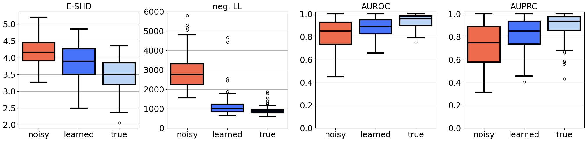

# Denoising Representation Learning for Causal Discovery

 This repository contains the code base of the research project for the master's thesis, presented for MSc in Statistics program at the University of Geneva. The research has been carried out in collaboration with Learning & Adaptive Systems Group at the Department of Computer Science of ETH Zürich.

## Overview

Discovering a causal structure underlying the variables in a system is an important task in many scientific disciplines. Most of the methods for causal structure learning operate under the assumption that observed data is an accurate reflection of the true interactions among the variables in a data-generating mechanism. However, observations in real-world datasets often contain noise and measurement error inherent to the data collection process, distorting the signal of the true dependencies. To mitigate the effect of such technical noise, we propose a principled approach for inferring the distribution of the unobservable signal from its noisy measurements by learning an *amortized variational denoising model*. 

Using a prior given by the generative model, we optimize the evidence lower bound to learn a latent representation of the noisy input that is meaningful under our causal generative assumptions. Figure below illustrates the denoising capability of our approach using a 2-dimensional linear Gaussian Bayesian network $\text{BN}(\mathbf{G}, \mathbf{\Theta})$ modeling $p(\mathbf{s} \mid \mathbf{G}, \mathbf{\Theta})$ as an example. True signal (light green) is contaminated with substantial technical noise (dark green), almost completely masking the true relationship between the two variables in this system. Using only the noisy samples (dark green), our proposed method is able to infer the posterior distribution $p(\mathcal{S} \mid \mathcal{D})$ over the likely signal values (light blue) by minimizing KL divergence to the prior $p(\mathcal{S})$ and optimizing reconstruction accuracy.

By amortizing posterior inference into an inference model, our trained models can be used on any unseen dataset from the same generative process. As a result, our denoising model can be combined upstream with structure learning algorithms that do not assume any measurement noise. In the experiments with linear Gaussian BNs and synthetic gene expression data, we demonstrate the empirical advantage of learning a causal model from the denoised representation with both classical and Bayesian structure learning methods. Figure below illustrates the results of joint posterior inference over linear Gaussian BNs using differential Bayesian structure learning framework (DiBS) ([Lorch et al., 2021](https://arxiv.org/abs/2105.11839)).

 

